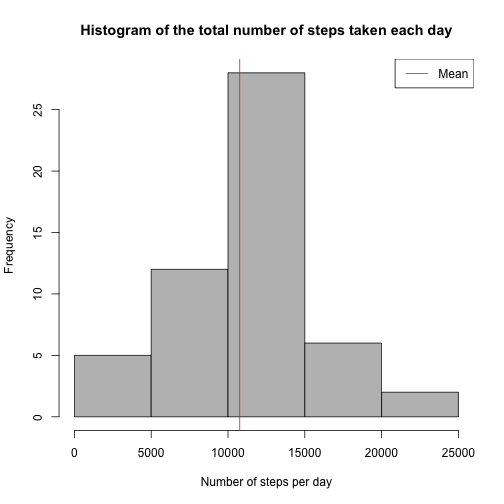
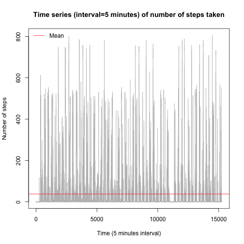
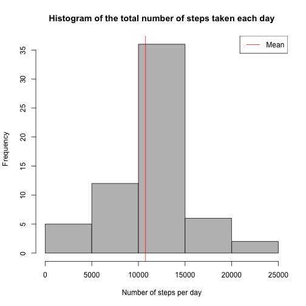
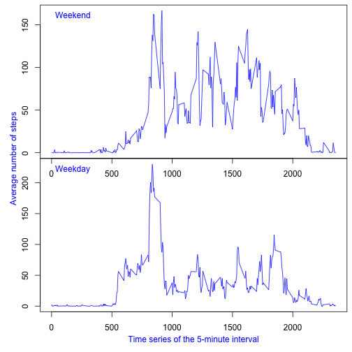

## Loading and preprocessing the data

1. Load the data and transform 'steps' to integer, date to 'Date' and 'interval' to integer:


```r
data <- read.csv("activity.csv", colClasses=c("integer","factor","integer"))
```

2. Remove 'NA' values:


```r
tidy <- data[!is.na(data$steps),]
```

## What is mean total number of steps taken per day?

1. Make a histogram of the total number of steps taken each day:


```r
# Sum of steps per day
stepsperday <- aggregate( tidy$steps, by=list(tidy$date), FUN=sum)
colnames(stepsperday) = c("date","totalsteps")

# Draw the histogram
hist( stepsperday$totalsteps,
      col = "gray",
      main = "Histogram of the total number of steps taken each day",
      xlab = "Number of steps per day")

# Draw a vertical red line for the mean value
abline(v = mean( stepsperday$totalsteps ),
       col = "red",
       lwd = 1)

# Draw the legend box at the top right
legend("topright",
       lty = 1,
       lwd = 1,
       col = c("red"),
       legend = c("Mean"))
```

 

2. Calculate and report the mean and median total number of steps taken per day:


```r
mean( stepsperday$totalsteps )
```

```
## [1] 10766.19
```

```r
median( stepsperday$totalsteps )
```

```
## [1] 10765
```

## What is the average daily activity pattern?

1. Make a time series plot (i.e. type = "l") of the 5-minute interval (x-axis) and the average number of steps taken, averaged across all days (y-axis)


```r
# Draw the time series plot
plot( tidy$steps,
      type="l",
      col = "gray",
      main = "Time series (interval=5 minutes) of number of steps taken",
      xlab = "Time (5 minutes interval)",
      ylab = "Number of steps")

# Draw a horizontal red line for the mean value
abline(h = mean( tidy$steps ),
       col = "red",
       lwd = 1)

# Draw the legend box at the top right
legend("topleft",
       lty = 1,
       lwd = 1,
       bty = "n",
       col = c("red"),
       legend = c("Mean"))
```

 

2. Which 5-minute interval, on average across all the days in the dataset, contains the maximum number of steps?


```r
message( "The 5-minute interval number ",
         tidy$interval[ which( tidy$steps == max(tidy$steps) ) ],
         " of date ",
         tidy$date[ which( tidy$steps == max(tidy$steps) ) ],
         " contains the maximum value which is ",
         max(tidy$steps),
         " steps.")
```

```
## The 5-minute interval number 615 of date 2012-11-27 contains the maximum value which is 806 steps.
```

## Imputing missing values

1. Calculate and report the total number of missing values in the dataset (i.e. the total number of rows with NAs)


```r
sum( is.na(data$steps) )
```

```
## [1] 2304
```

2. Devise a strategy for filling in all of the missing values in the dataset. The strategy does not need to be sophisticated. For example, you could use the mean/median for that day, or the mean for that 5-minute interval, etc.

**The strategy used to filling in all of the missing values in the dataset is to use the mean for that 5-minute interval.**

3. Create a new dataset that is equal to the original dataset but with the missing data filled in.


```r
# Create a new dataset that is equal to the original dataset
d <- data

# Calculate the mean number of steps for each 5-minute interval (round without decimal)
meanstepsperintervalnumber <- round( aggregate( tidy$steps,
                                                by=list(tidy$interval),
                                                FUN=mean),
                                     0)
colnames( meanstepsperintervalnumber ) = c("interval","meansteps")

# Replace 'NA' by the associated mean steps for the given 5-minute interval
for ( i in 1:nrow(d)) {
    if ( is.na(d$steps[i]) ) {
        d$steps[i] <- meanstepsperintervalnumber$meansteps[  meanstepsperintervalnumber$interval %in% d$interval[i]  ]
    }
}
```

4. Make a histogram of the total number of steps taken each day and Calculate and report the mean and median total number of steps taken per day. Do these values differ from the estimates from the first part of the assignment? What is the impact of imputing missing data on the estimates of the total daily number of steps?


```r
# Sum of steps per day
stepsperdayfilledin <- aggregate( d$steps, by=list(data$date), FUN=sum)
colnames(stepsperdayfilledin) = c("date","totalsteps")

# Draw the histogram
hist( stepsperdayfilledin$totalsteps,
      col = "gray",
      main = "Histogram of the total number of steps taken each day",
      xlab = "Number of steps per day")

# Draw a vertical red line for the mean value
abline(v = mean( stepsperdayfilledin$totalsteps ),
       col = "red",
       lwd = 1)

# Draw the legend box at the top right
legend("topright",
       lty = 1,
       lwd = 1,
       col = c("red"),
       legend = c("Mean"))
```

 

```r
# Calculate the mean
mean( stepsperdayfilledin$totalsteps )
```

```
## [1] 10765.64
```

```r
# Calculate the median
median( stepsperdayfilledin$totalsteps )
```

```
## [1] 10762
```

Those values differ from the estimates from the first part of the assignment. The impact is that cleaning data or filled in missing data changes both mean and median values when calculate number of steps per day.

|Number of steps taken each day |Mean|Median|
|---|---|---|
|Tidy Data without missing values|10766.19|10765|
|Original data with filled in missing data|10765.64|10762|

## Are there differences in activity patterns between weekdays and weekends?

1. Create a new factor variable in the dataset with two levels -- "weekday" and "weekend" indicating whether a given date is a weekday or weekend day.


```r
d$typeday <- weekdays( as.Date(d$date) )
d$typeday[ which(d$typeday == "Lundi") ]    <- "weekday"
d$typeday[ which(d$typeday == "Mardi") ]    <- "weekday"
d$typeday[ which(d$typeday == "Mercredi") ] <- "weekday"
d$typeday[ which(d$typeday == "Jeudi") ]    <- "weekday"
d$typeday[ which(d$typeday == "Vendredi") ] <- "weekday"

d$typeday[ which(d$typeday == "Samedi") ]   <- "weekend"
d$typeday[ which(d$typeday == "Dimanche") ] <- "weekend"

d$typeday <- as.factor(d$typeday)
```

2. Make a panel plot containing a time series plot (i.e. type = "l") of the 5-minute interval (x-axis) and the average number of steps taken, averaged across all weekday days or weekend days (y-axis).


```r
# Separate the dataset in 'weekday' and 'weekend'
dataweekday = subset( d, typeday=="weekday", select= c("interval","steps"))
dataweekend = subset( d, typeday=="weekend", select= c("interval","steps"))

# Mean of steps per interval for 'weekday' and 'weekend'
meanstepsintervalweekday <- aggregate( dataweekday , by=list(dataweekday$interval), FUN=mean)
meanstepsintervalweekend <- aggregate( dataweekend , by=list(dataweekend$interval), FUN=mean)

# Divide the graphics device in two vertical plot without margin
par(mfrow = c(2,1), mar = c(0,0,0,0), oma = c(4, 4, 0.5, 0.5))

# Draw at the top the time series of the 5-minute interval and the average of steps taken across all weekend days
plot( meanstepsintervalweekend$interval,
      meanstepsintervalweekend$steps,
      type="l",
      col = "blue")
legend( "topleft", text.col = "blue", c("Weekend"), bty="n" )

# Draw at the bottom the time series of the 5-minute interval and the average of steps taken across all weekday days
plot( meanstepsintervalweekday$interval,
      meanstepsintervalweekday$steps,
      type="l",
      col = "blue")
legend( "topleft", text.col = "blue", c("Weekday"), bty="n" )

# Add x-axis and y-axis legends
mtext( "Time series of the 5-minute interval",
       side = 1,
       outer = TRUE,
       line = 2.2,
       col = "blue")
mtext( "Average number of steps",
       side = 2,
       outer = TRUE,
       line = 2.2,
       col = "blue")
```

 

